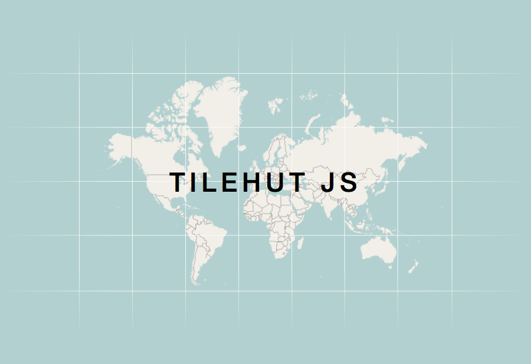

Tilehut.js
==========
### A modest, but cozy home for your map tiles

Tilehut.js is a project by:

- [Benedikt Groß](http://benedikt-gross.de)
- [Joey K. Lee](http://jk-lee.com)
- [Stephan Bogner](http://stephanbogner.de)
- [Stefan Landsbek](http://47nord.de) (47Nord)

## Introduction
Take all the best things about the interactivity of the web and couple it with the exploratory nature of maps, and you get the modern web map tile. Tiles are one of the fundamental building blocks of modern web maps, providing a clever solution to zoom, pan, click, and interact with the infinity of discoverable things living in geospace. Underlying map tiles is a tasty combination of awesome technologies like [Mike Migurski's](http://mike.teczno.com/) [Tilestache](http://tilestache.org/) and the brilliant tools being built by [Mapbox](mapbox.com).

Drawing from these inspiring developments in the web mapping world, we bring you Tilehut.js, a modest, but cozy home for your map tiles. Tilehut.js is built to serve the tiles for your average web mapping project and is essentially a simple wrapper around Mapbox's [node-mbtiles](https://github.com/mapbox/node-mbtiles). Tilehut.js is indeed a humble tile server and is certainly not a replacement for the all excellent support that comes with Mapbox hosting for those more demanding or bigger projects.

We're thrilled to bring you Tilehut.js and even more excited to see what projects you brew up! Happy mapping!

## Your Own Hosted Tileserver in 5 Minutes
1. Login to **[OpenShift](https://www.openshift.com/)** and create a **new application** (the free account will give you already a 1GB tileserver)
2. Set Application Type as **"NodeJS"**
3. Use `https://github.com/b-g/tilehut/` as **source code** for your Application
4. Connect via **SFTP** to OpenShift and **drop a .MBtiles tileset** into the folder `/app-root/data/`
5. Done!

Now you can inspect your map ...

`{appname}-{youropenshiftdomain}.rhcloud.com/{tilesetname}/map`

... and the tiles are ready to use via

`{appname}-{youropenshiftdomain}.rhcloud.com/{tilesetname}/{z}/{x}/{y}.png`

You can of course also install Tilehut.js on your local machine or to any other server which supports node.js.

## Tutorial: Getting Started with Tiles
We prepared quite a comprehensive [tutorial](https://github.com/b-g/tilehut/tree/master/tutorial) which covers everything step-by-step. Starting from creating a tileset, to setting up OpenShift and finally using your own tileset.

- [1A. Create a Raster/Bitmap Tileset (in TileMill)](tutorial#1-create-tileset-in-tilemill)
  - [Step 1: Get TileMill](tutorial#step-1-get-tilemill)
  - [Step 2: Create a new Project](tutorial#step-2-create-a-new-project)
  - [Step 3: Import Data](tutorial#step-3-import-data)
  - [Step 4: Style your Map](tutorial#step-4-style-your-map)
  - [(Optional Step 5: Add UTF-8 Grid)](tutorial#optional-step-5-add-utf-8-grid)
  - [Step 6: Export Map](tutorial#step-6-export-map)
- [1B. Create Vector Tiles (with GeoJSON & Tippecanoe)](tutorial#1b-create-vector-tiles-with-geojson--tippecanoe)
- [2. Run Tile Server](tutorial#2-run-tile-server)
  - [Option 1: Via Localhost](tutorial#option-1-via-localhost)
  - [Option 2: Via OpenShift](tutorial#option-2-via-openshift)
    - [Preparations:](tutorial#preparations)
    - [Easy Setup:](tutorial#easy-setup)
    - [Expert Setup:](tutorial#expert-setup)
      - [Step 1: Learn Git](tutorial#step-1-learn-git)
      - [Step 2: Create New Project](tutorial#step-2-create-new-project)
      - [Step 3: Set Up Repository](tutorial#step-3-set-up-repository)
    - [Check the Status](tutorial#check-the-status)
    - [Add tiles via SFTP](tutorial#add-tiles-via-sftp)
    - [Test the Tiles](tutorial#test-the-tiles)
- [3. Use The Tileset](tutorial#3-use-the-tileset)

## Examples

See the [examples](https://github.com/b-g/tilehut/tree/master/examples) folder for how to use the tilset (raster, utf-8 grid and vector tiles) in your own projects.

## API

### Inspector
Visit `server/{tilesetname}/map` to inspect a tileset. This works for raster, utf-8 and vector tiles.

### ZXY
The tiles are served via `server/{tileset-name}/{z}/{x}/{y}.{extension}` e.g.:

- bitmap e.g. `server/tiles-world-simple/4/7/7.png`
- vector e.g. `server/tiles-world-vector/5/17/10.pbf`
- utf-8 grid e.g. `server/tiles-world-utfgrid/4/10/6.grid.json`

### Meta Information
Get the meta informations e.g. lat/lon bounds, min and max zoom level etc. via `server/{tileset-name}/meta.json`

### Ping (is my server running?)
Check whether you server works by calling `server/ping`. Server should respond: "tilehut says pong!"

### Development
`$ npm run watch`

## Acknowledgments

- Tilehut.js is just a wrapper of [node-mbtiles](https://github.com/mapbox/node-mbtiles) by [Mapbox](https://www.mapbox.com/)
- Tilehut.js was inspired by [Tilestache](http://tilestache.org/) of [Mike Migurski](http://mike.teczno.com/)
- Tilehut.js was kicked off by Tobin Bradley's great [tutorial](https://www.youtube.com/watch?v=CwAQSKsSQhI) on writing your own [mbtiles-server](https://github.com/tobinbradley/mbtiles-server)

