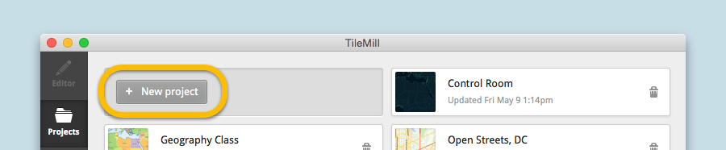
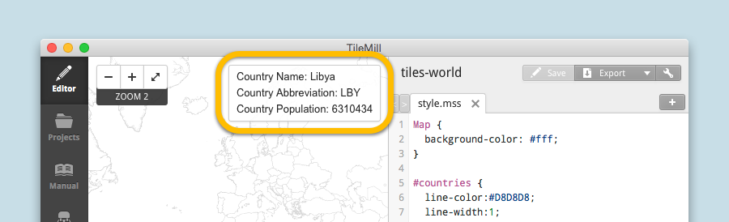
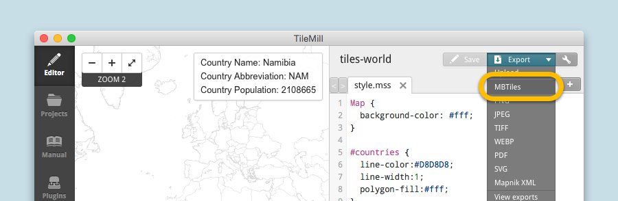
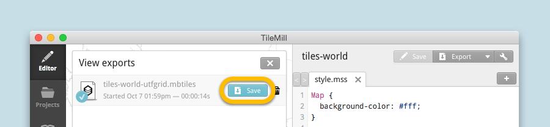
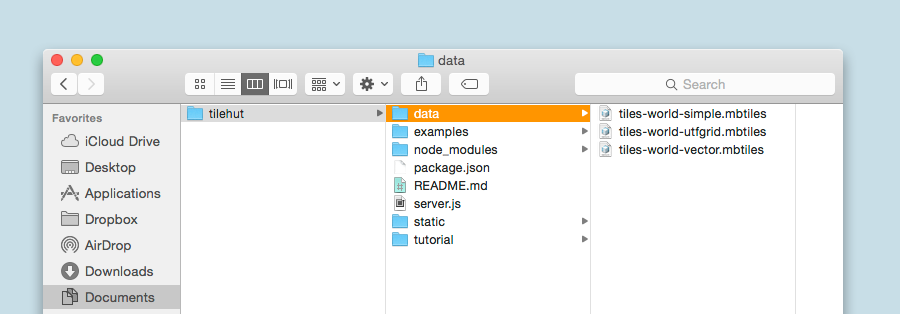
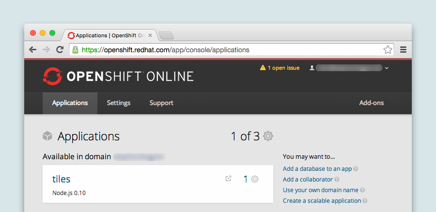

# Getting Started with Tiles
## 1. Create Tileset (in Tilemill)

### Step 0: Get TileMill
Download and install [TileMill](https://www.mapbox.com/tilemill/) if you haven't done so already. If this is new to you: TileMill is an design studio by the amazing team at [Mapbox](mapbox.com) to create beautiful maps.

And If you haven't heard of Mapbox – check it out their [website](mapbox.com) and [blog](https://www.mapbox.com/blog/).

Once everything is set up, we can start.

### Step 1: Create a new Project
Add a **new project**.

**Set a name** for your project and **untick the "Default data"-checkbox**, because we are creating a map from scratch.

This is what you should end up with **following**:

### Step 2: Import Map Data
You can choose from a variety of formats, but we are going for an ESRI Shapefile. Basically the shape file is like a vector file which is made for geospatial data.

Open layer menu and **add a new layer**.

**Browse Datasource** and select the **"countries.shp"** file from the tutorial folder (or use your own data). Then press **"Save & Style"**.

You will end up with something like **that**:

**Note:** The layer-name is already inserted, but you can always check the name in the layer menu at the bottom left.

### Step 3: Style your Map
Mapbox provides a [great tutorial](https://www.mapbox.com/tilemill/docs/crashcourse/styling/) on how to style maps with tilemill, or use **our style** and follow the tutorial:

    Map {
      background-color: #fff;
    }

    #countries {
      line-color:#D8D8D8;
      line-width:1;
      polygon-fill:#fff;
    }
    

### ( Optional Step: Add UTF-8 Grid )

**Note:** A UTF-8 grid adds the possibility to add hover events to a map. Our example shows a country's name, abbreviation and population. But this will also increase the size of your tileset, so only add this if you need it. [This article](https://www.mapbox.com/blog/how-interactivity-works-utfgrid/) by Mapbox does a good job explaining the UTF-8 grid functionality.

**Enable Interactivity** for hover events.

**Add the [MustacheJS](https://github.com/janl/mustache.js) template**.
For our shape file the data will look like below, but you can inspect the data of each layer in the layer menu (bottom left):

    Country Name: {{{ADMIN}}}  
    Country Abbreviation: {{{ne_10m_adm}}}  
    Country Population: {{{POP_EST}}}

If you now **hover over a country**. It will show the text you defined with the mustache template, filled with the data from the shape file.

### Step 4: Export Map
Hit **"Export"** and select **"MBtiles"** as a file format.

**Name your tileset** and **set the zoom dimensions**. Choose a zoom level from 0 (all the way zoomed out) to something around 4, to keep the file size of our tileset small. Then hit **"Export"**.

This will take a while. Once it's done: **Save it** and **move the ".mbtiles"-file** ...

... into the **"data"-folder** of your TileHutJS directory to look like following:

## 2. Run Tile Server
### Option 1: Via Localhost
Open the **Terminal**, **navigate to the TileHutJS** folder and **run** `node server.js` to serve the files. As you can see, your server is now running at <http://localhost:8000/>.

**Note:** You can inspect tilesets (even unknown ones) by opening them in your **browser**, e.g. <http://localhost:8000/tiles-world-simple/map/>. This works for normal raster tiles, as well as UTF-8 tiles and even vector tiles.

### Option 2: Via OpenShift
[OpenShift](https://www.openshift.com/) is a service, where you can set up a cloud-based application. The Basic functionality is free.

#### Step 0: Learn Git
Openshift is using Git. If you don't know what Git means: basically Git is used to keep track of your files. No "file_v4_final_reallyfinal.png"-files anymore and you can always go back in time.
 
[Github](https://try.github.io/) has a fun introduction into Git, and [this guy](http://betterexplained.com/articles/a-visual-guide-to-version-control/) did a nice writeup why you should use somekind version control (there are alternatives to git). So if you don't know anything about it. Now is the time.

#### Step 1: Create New Project
**Log into [Openshift](https://www.openshift.com/)** or create an account and create a **new project**. 
Select Application-type: **Node.js** and fill out the rest. If you are new to Openshift, there is a [beginner's guide](https://developers.openshift.com/en/getting-started-overview.html) for you.

#### Step 2: Set up repository Repository
You can either way just push the TileHutJS repository onto Openshift or clone the repo and add the files you need. Grab the ssh-key from your application site on Openshift.

     git clone ssh://somekey@projectname-youropenshiftdomain.rhcloud.com/~/git/projectname.git/
     
or:

     git push openshift master --force
     

#### Step 3: Check the Status
go to `http://projectname-youropenshiftdomain.rhcloud.com/ping` and check if the server returns **"tilehut says pong!"**. 

If it does you are almost there. If it doesn't the repository probably didn't sync properly. But you can check that also via FTP (see next step).

#### Step 4: Add tiles via FTP
**Connect via FTP** to Openshift. There is a [quick Tutorial](http://www.openshifttutorial.cu.cc/access-to-openshift-through-sftp/) on how to conenct via Cyberduck, but it will work with Filezilla or every other FTP client as well.

**Navigate** to `app-root/data/`inside openshift and **paste the tilesets** you want to host.

**Note:** The reason why this folder is empty is how cloud computing works. If you want to serve tiles on a grand scale you should set up a seperate server, because now the tiles would not be mirrored properly if you'd set up a scalable project. It's enough for our purpose, so we keep it simple.

#### Step 5: Test the Tiles
**Goto** `http://project-youropenshiftdomain.rhcloud.com/name-of-tileset/map` and look at the beautiful map you just hosted. You can now use them in your website or anywhere else. Check out our example files.

## 3. Use The Tileset
We included some example files into the repository which show you how to use [Leaflet JS](http://leafletjs.com/) or [Mapbox GL JS](https://www.mapbox.com/blog/mapbox-gl-js/) to display the maps using your tileset.

**Check:** `tilehut/examples/`
