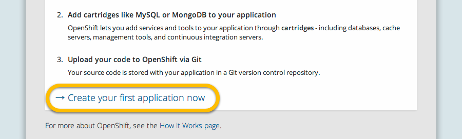
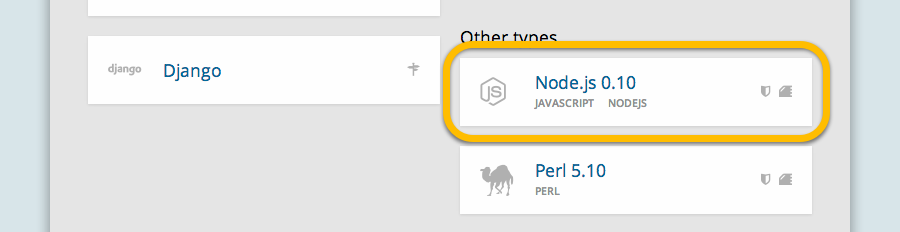
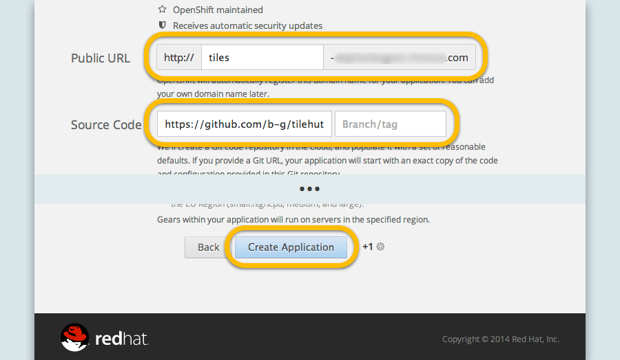
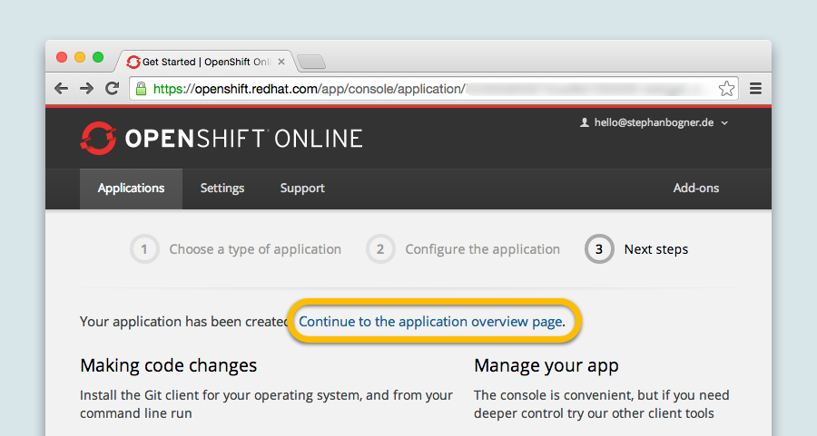
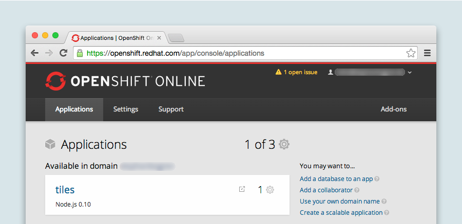
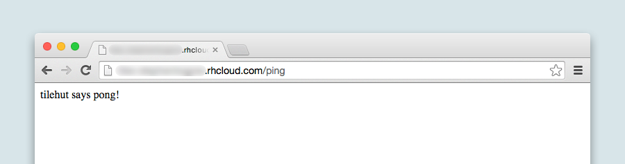
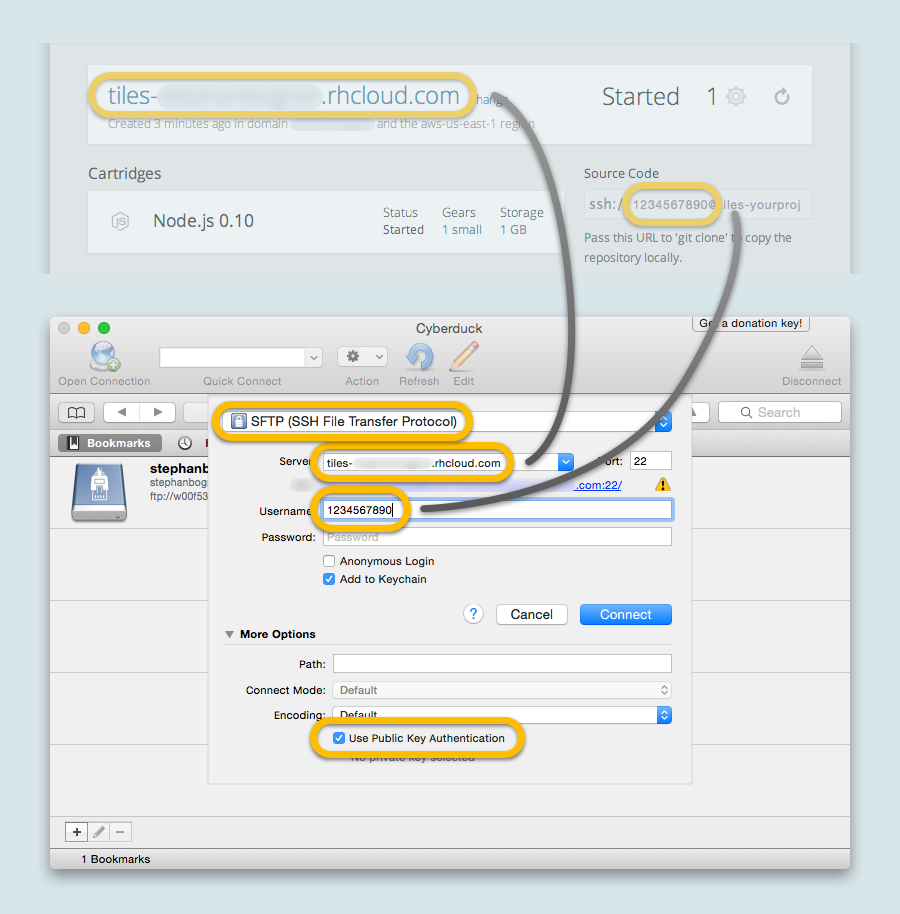
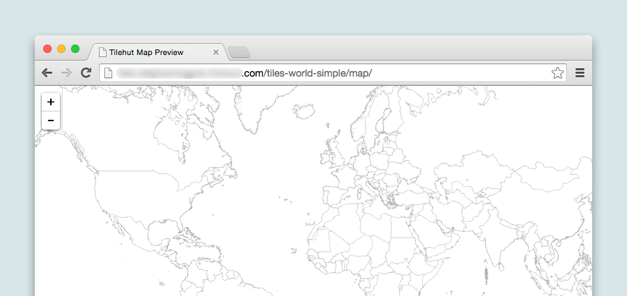

Getting Started with Tiles
==========================

<!-- START doctoc generated TOC please keep comment here to allow auto update -->
<!-- DON'T EDIT THIS SECTION, INSTEAD RE-RUN doctoc TO UPDATE -->


- [1A. Create Raster/Bitmap Tileset (in TileMill)](#1a-create-rasterbitmap-tileset-in-tilemill)
  - [Step 1: Get TileMill](#step-1-get-tilemill)
  - [Step 2: Create a new Project](#step-2-create-a-new-project)
  - [Step 3: Import Data](#step-3-import-data)
  - [Step 4: Style your Map](#step-4-style-your-map)
  - [(Optional Step 5: Add UTF-8 Grid)](#optional-step-5-add-utf-8-grid)
  - [Step 6: Export Map](#step-6-export-map)
- [1B. Create Vector Tiles (with GeoJSON & Tippecanoe)](#1b-create-vector-tiles-with-geojson--tippecanoe)
- [2. Run Tile Server](#2-run-tile-server)
  - [Option 1: Via Localhost](#option-1-via-localhost)
  - [Option 2: Via OpenShift](#option-2-via-openshift)
    - [Preparations:](#preparations)
    - [Easy Setup:](#easy-setup)
    - [Expert Setup:](#expert-setup)
      - [Step 1: Learn Git](#step-1-learn-git)
      - [Step 2: Create New Project](#step-2-create-new-project)
      - [Step 3: Set Up Repository](#step-3-set-up-repository)
    - [Check the Status](#check-the-status)
    - [Add tiles via SFTP](#add-tiles-via-sftp)
    - [Test the Tiles](#test-the-tiles)
- [3. Use The Tileset](#3-use-the-tileset)

<!-- END doctoc generated TOC please keep comment here to allow auto update -->


## 1A. Create Raster/Bitmap Tileset (in TileMill)

### Step 1: Get TileMill
Download and install [TileMill](https://www.mapbox.com/tilemill/) if you haven't done so already. If this is new to you: TileMill is an design studio by the amazing team at [Mapbox](mapbox.com) to create beautiful maps.

And If you haven't heard of Mapbox – check out their [website](mapbox.com) and [blog](https://www.mapbox.com/blog/).

Once everything is set up, we can start.

### Step 2: Create a new Project
Add a **new project**.


**Set a name** for your project and **untick the "Default data"-checkbox**, we are going to creating a map from scratch. Of course!


You should end up with something like the following:


### Step 3: Import Data

You can choose from a variety of formats (e.g. GeoJSON, ESRI Shapefile, etc), but in this tutorial we will use an ESRI Shapefile of the world country boundaries. A shapefile is a vector file (of either points, lines, or polygons) that has attributes and is georeferenced. 

** Hint:** [optimizing your shapefiles](https://www.mapbox.com/tilemill/docs/guides/optimizing-shapefiles/) can help increasing the performance or your data in tilemill.

Open the layer menu and **add a new layer**.


**Browse Datasource** and select the **"countries.shp"** file from the tutorial folder (or use your own data). Then press **"Save & Style"**.


Now you should see the world country boundaries:


### Step 4: Style your Map
Mapbox has a [great tutorial](https://www.mapbox.com/tilemill/docs/crashcourse/styling/) on how to style maps with tilemill.

We go miniml and set the style for the countries to grey thin lines with a white fill:

    Map {
      background-color: #fff;
    }

    #countries {
      line-color:#D8D8D8;
      line-width:1;
      polygon-fill:#fff;
    }
    


### (Optional Step 5: Add UTF-8 Grid)

**Note:** A UTF-8 grid adds the possibility to add interaction hover events to a map. Our example shows for instance for every country feature the name, abbreviation and population. If data size or storage is an issue, it is useful to know that adding the hover events will increase the size of your tileset. [This article](https://www.mapbox.com/blog/how-interactivity-works-utfgrid/) by Mapbox does a good job explaining the UTF-8 grid functionality.

**Enable Interactivity** for hover events.


**Add the [MustacheJS](https://github.com/janl/mustache.js) template**.
For our shapefile the data will look like below, but you can inspect the data of each layer in the layer menu (bottom left):

    Country Name: {{{ADMIN}}} <br>
    Country Abbreviation: {{{ne_10m_adm}}} <br>
    Country Population: {{{POP_EST}}}


If you now **hover over a country**. It will show the text you defined with the mustache template, filled with the data from the shapefile.


### Step 6: Export Map
Hit **"Export"** and select **"MBtiles"** as a file format.


Give your tileset a **Name** and set the **min - max zoom dimensions**. Here we choose a zoom level from 0 (all the way zoomed out) to something around 4, to keep the file size of our tileset small (but you quite likley want more zoom levels for future projects). Then hit **"Export"**.


This will take a while. Once it's done: **Save it** and ...


... **move the "MBtiles"** into the data folder of your Tilehut.js directory. This will look like following:


***

## 1B. Create Vector Tiles (with GeoJSON & Tippecanoe)

Let's take our `countries.geojson` file and turn it into a vector tile set. Lucky for us [Mapbox](mapbox.com) has built a great commandline tool called [tippecanoe](https://github.com/mapbox/tippecanoe). In order to install it on your machine, please follow the instructions [here](https://github.com/mapbox/tippecanoe#installation):

```
$ brew install tippecanoe
```

Once [tippecanoe](https://github.com/mapbox/tippecanoe) is installed, you can run the following on your `countries.geojson` file:

```
$ tippecanoe -o tiles-world-vector.mbtiles -z5 -pp countries.geojson 
```
What's happening here: 

* **tippecanoe**: this calls the tippecanoe function
* **-o tiles-world-vector**: says, "our output file will be called tiles-world-vector.mbtiles"
* **-z5**: tells tippecanoe to only produce tiles to a max of zoom level 5.
* **-pp**: means "no polygon splitting"
* **countries.geojson**: is the geojson file of our countries.

You can read about the other options for producing vector tiles [here](https://github.com/mapbox/tippecanoe#options).

**And that's it! Now we have beautiful vector tiles to work with. Now let's set up our server. Keep going!**

***

## 2. Run Tile Server
### Option 1: Via Localhost
Open the **Terminal**, **navigate to the Tilehut.js** folder and **run** `node server.js` to serve the files. As you can see, your server is now running at <http://localhost:8000/>.


You can inspect tilesets (even unknown ones) by opening them in your **browser**, e.g. <http://localhost:8000/tiles-world-simple/map/>. This works for normal raster tiles, as well as UTF-8 tiles and even vector tiles.


### Option 2: Via OpenShift
[OpenShift](https://www.openshift.com/) is a service, where you can set up a cloud-based application. The Basic functionality is free.

If you are new to Openshift, there is a [beginner's guide](https://developers.openshift.com/en/getting-started-overview.html) for you.

#### Preparations:
- Install the [Openshift Client Tools](https://developers.openshift.com/en/getting-started-client-tools.html)


#### Easy Setup:
Click **"Create your first application"**.


Select **Node.js** as your type of application.


Choose the **name of your application** (and your OpenShift domain name) and use `https://github.com/b-g/tilehut/` as **Source Code**, then OpenShift will just grab the code from the repository.


Click **Continue**.


**Done!** Hence you can "Expert Setup" and follow the tutorial at **["Check The Status"](#check-the-status)**

#### Expert Setup:
##### Step 1: Learn Git
Openshift uses [Git](http://git-scm.com/). Git is a versioning control software that helps you to keep track of your files over time. 
 
[Github](https://try.github.io/) has a fun introduction into Git, and [this guy](http://betterexplained.com/articles/a-visual-guide-to-version-control/) did a nice writeup why you should use somekind version control (there are alternatives to git). So if you don't know anything about it. Now is the time to dive in.

##### Step 2: Create New Project
**Log into [Openshift](https://www.openshift.com/)** or and create a **new project**. 
Select Application-type: **Node.js** and fill out the rest.



##### Step 3: Set Up Repository
You can either way just push the Tilehut.js repository onto Openshift or clone the repo and add the files you need. Grab the ssh-key from your application site on Openshift.

     git clone ssh://somekey@projectname-youropenshiftdomain.rhcloud.com/~/git/projectname.git/
     
or:

     git push openshift master --force
     

#### Check the Status
go to `http://appname-youropenshiftdomain.rhcloud.com/ping` and check if the server returns **"tilehut says pong!"**. 

If it does you are almost there. If it doesn't the repository probably didn't sync correctly. But you can check that also via FTP (see next step).


#### Add tiles via SFTP
**Connect via SFTP** to Openshift. We use [Cyberduck](https://cyberduck.io/) to connect, but it will work with [Filezilla](https://filezilla-project.org/) or every other SFTP client as well.

**Select SFTP** as protocol, then take the **server name** and the **username** from the OpenShift page for your application. Tick the **"Use Public Authentication"** checkbox and select "**id_rsa**" (It come with the git setup and can be found on your local hard drive here: `~/.ssh/id_rsa` e.g. /Users/benedikt/.ssh/id_rsa).




**Navigate** to `app-root/data/` in Cyberduck (or your FTP client) and **upload the tilesets** you want to host.

If you can't connect via FTP, then you probably skipped the [preparations](#preparations) step or you chose FTP instead of SFTP. Then your rsa-keys have not been configured.


#### Test the Tiles
**Goto** `{appname}-{youropenshiftdomain}.rhcloud.com/{tilesetname}/map` and look at the beautiful map you just hosted. Well done! You can now use them in your website or anywhere else. For a quickstart on this you might want to check out our examples folder.



## 3. Use The Tileset
We included some example files into the repository which show you how to use [Leaflet JS](http://leafletjs.com/) or [Mapbox GL JS](https://www.mapbox.com/blog/mapbox-gl-js/) to display a map using your tileset.

**Check:** `tilehut/examples/` ([Github](https://github.com/b-g/tilehut/tree/master/examples))


